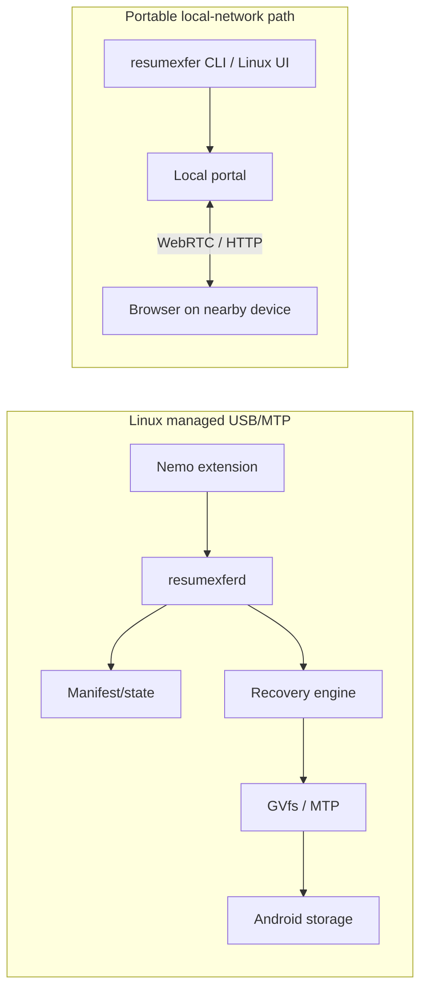

# Resumexfer

**Resumable Android USB/MTP transfers on Linux + zero-install Wi‑Fi/LAN file sharing for Linux, Windows, macOS, phones, and browsers.**

Resumexfer is built for the annoying transfer that should not have to restart because a USB cable moved, Android remounted MTP, Wi‑Fi changed, or a large multi-file job was interrupted.

On Linux Mint/Ubuntu with Nemo, Resumexfer can take ownership of Android USB/MTP copy/paste jobs, preserve verified progress, and continue after reconnect. On Linux, Windows, and macOS, the standalone `resumexfer` command can share or receive files over the local network while the other device uses only its normal browser.

No Android companion app and no Resumexfer cloud account are required.

## Why Resumexfer?

Normal MTP copies are often all-or-nothing from the user's point of view. Resumexfer adds a durable job model around the transfer:

- resume interrupted **phone → computer** and **computer → phone** Android MTP jobs on the supported Linux integration,
- preserve verified partial data instead of blindly restarting,
- automatically recover after USB disconnect/reconnect,
- pause, resume, cancel, keep completed files, or undo files owned by the current job,
- continue whole multi-file/folder jobs instead of handling only the file that happened to be active,
- skip verified duplicates without trusting filenames alone,
- share/receive through a temporary **local Wi‑Fi/LAN browser link**,
- use a WebRTC DataChannel fast path where available, with HTTP/range fallback,
- transfer between laptops without installing Resumexfer on the second laptop.

## Platform support

| Platform | Local Wi‑Fi/LAN Share/Receive | Managed Android USB/MTP resume | Integration |
| --- | --- | --- | --- |
| Linux Mint / Ubuntu + Nemo | ✅ | ✅ | Nemo + GVfs + per-user daemon |
| Other Linux desktops | ✅ | ⚠️ No managed file-manager MTP integration | Standalone CLI |
| Windows 10/11 | ✅ Build-validated | ❌ Not yet | Standalone CLI |
| macOS Intel | ✅ Build-validated | ❌ Not yet | Standalone CLI |
| macOS Apple Silicon | ✅ Build-validated | ❌ Not yet | Standalone CLI |

Windows/macOS support in 0.2.1 is the portable local-network/browser transfer engine. Resumexfer does **not** claim native Explorer/Finder Android USB resume yet.

See [Platform support](docs/PLATFORMS.md) for the exact scope.

## Quick start

### Linux: full Nemo + Android USB/MTP integration

Install the Debian package from the release:

```bash
sudo apt install ./resumexfer_0.2.1_amd64.deb
nemo -q
```

Normal managed USB use needs no terminal command:

1. Connect and unlock the Android phone.
2. Select **File Transfer / MTP** on the phone.
3. In Nemo, copy file(s) or a folder with **Ctrl+C**.
4. Navigate to a folder on the other device.
5. Press **Ctrl+V** once.
6. Use the Resumexfer progress window for Pause/Resume/Cancel.
7. If USB disconnects, reconnect/unlock/select File Transfer. Do **not** paste again.

The same managed job resumes from verified preserved data.

### Linux / Windows / macOS: local-network sharing

Share one or more files/folders:

```text
resumexfer share <file-or-folder> [more paths...]
```

Receive into a folder:

```text
resumexfer receive <destination-folder>
```

Resumexfer prints a temporary local URL. Open it on the other phone or laptop. The other device needs only a modern browser on the same local network.

Examples:

```bash
# Linux/macOS
resumexfer share ~/Videos/movie.mkv
resumexfer receive ~/Downloads
```

```powershell
# Windows
.\resumexfer_0.2.1_windows_amd64.exe share "C:\Users\user\Downloads\Example"
.\resumexfer_0.2.1_windows_amd64.exe receive "C:\Users\user\Downloads"
```

## What happens when a transfer is interrupted?

### Phone → laptop

For managed Linux USB/MTP jobs, Resumexfer writes into job-owned partial data and records durable progress. After reconnect, it validates the source/partial relationship and continues only the missing bytes.

A phone → laptop job can also move from USB to the browser portal and continue the remaining managed job. A verified Wi‑Fi checkpoint can later be adopted by USB recovery.

### Laptop → phone

For managed Linux USB/MTP jobs, the phone-side partial is re-statted and its preserved prefix is verified against the source before append recovery.

If USB is switched to Wi‑Fi, an ordinary zero-install Android browser cannot append directly into the MTP-created partial file. Resumexfer therefore:

- restarts that current file over Wi‑Fi when it is the only remaining item, or
- sends the **whole remaining multi-file/folder job as a ZIP**, preserving relative paths and excluding files already completed over USB.

Reconnect USB instead when you want to continue the actual verified MTP partial.

## Multi-file and folder behavior

Resumexfer tracks a manifest for the whole managed job rather than treating every file as an unrelated copy.

That enables:

- already-completed files to stay completed,
- the current partial to retain its verified offset where the transport supports it,
- untouched files to continue afterward,
- duplicate basenames in different subfolders,
- Unicode paths,
- zero-byte files,
- job-level Pause/Resume/Cancel,
- **Keep completed files** and **Undo entire transfer** without deleting unrelated pre-existing data.

## Architecture



The local-network portal is shared across Linux, Windows, and macOS; the Nemo/GVfs managed USB layer is Linux-specific.

Read the full [architecture documentation](docs/ARCHITECTURE.md).

## Safety and integrity

Resumexfer deliberately fails closed when it cannot prove that a resume/cleanup is safe.

- Changed sources are rejected.
- Existing partials are verified before append recovery.
- Filenames alone never authorize a resume.
- Duplicate suppression requires strong content confirmation.
- Whole-job Undo removes only files proven to belong to that Resumexfer job.
- Managed transfers are serialized to avoid competing MTP writers.
- Completed UI state is separate from byte progress; reaching 100% does not bypass final verification.

## Security and privacy

Transfers are local-first. Resumexfer does not require a cloud account, API key, or hosted relay.

The browser portal uses temporary capability links, local-address restrictions, Host/Origin validation, defensive response headers, and encrypted WebRTC DataChannels. The bootstrap page/signaling currently uses local HTTP, so the portal is intended for a network you trust—not a hostile public LAN.

See [SECURITY.md](SECURITY.md) for the threat model and reporting process.

## Validation

The project contains focused regression suites for correctness rather than only happy-path copy tests. Coverage includes:

- 100-file and 403-file managed jobs,
- 207-file USB↔Wi‑Fi whole-job handoffs,
- nested folder trees in both directions,
- duplicate basenames, Unicode paths, and zero-byte files,
- byte-for-byte destination checks,
- multi-file mid-transfer Pause/Resume,
- 100-file cancellation cleanup,
- USB disconnect/reconnect and daemon restart,
- Wi‑Fi→USB checkpoint adoption,
- WebRTC offset resume,
- lock contention, hang/deadlock, race-detector, fuzz, and completion-window regressions,
- real GTK Share/Receive/Continue lifecycle checks under Xvfb.

Platform claims remain separate from test claims: Windows/macOS standalone binaries are cross-build validated; the full managed Android USB/MTP workflow is Linux/Nemo/GVfs-specific.

## Build from source

Requirements for the portable CLI are Go 1.25+.

```bash
go test ./...
go build ./cmd/resumexfer
```

Build all portable release binaries:

```bash
bash scripts/build-cross-platform.sh
```

Build the Linux Debian package:

```bash
bash scripts/build-deb.sh
```

Run the public repository safety check before publishing:

```bash
python3 scripts/public-safety-check.py
```

## Repository guide

- [Architecture](docs/ARCHITECTURE.md)
- [Platform support](docs/PLATFORMS.md)
- [Troubleshooting](docs/TROUBLESHOOTING.md)
- [Security](SECURITY.md)
- [Contributing](CONTRIBUTING.md)
- [Changelog](CHANGELOG.md)
- [MIT License](LICENSE)

## License

Resumexfer is released under the [MIT License](LICENSE).

## Current limitations

- Native managed Android USB/MTP resume is currently a Linux/Nemo/GVfs feature.
- Windows/macOS currently use the standalone local-network portal, not Explorer/Finder MTP interception.
- The browser portal uses local HTTP for zero-install bootstrap; use it on a network you trust.
- Laptop → phone USB→Wi‑Fi cannot transparently append into the existing Android MTP partial from a normal HTTP browser.
- Browser downloads ultimately follow the destination/browser's normal save semantics.

## Project direction

The recovery engine is intentionally transport-conscious rather than pretending every OS/file manager behaves the same. Future Windows Explorer and macOS Finder integrations should reuse the manifest/integrity model while implementing their platform-specific device-transfer semantics separately.

If you are fixing a bug, check the mirror direction and equivalent transport path too. That rule is part of the project's contribution guidance because several important bugs only appeared when a single-file assumption met a multi-file or cross-transport job.
