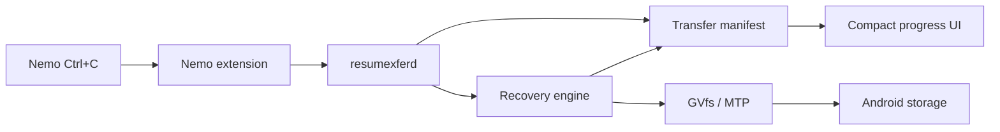
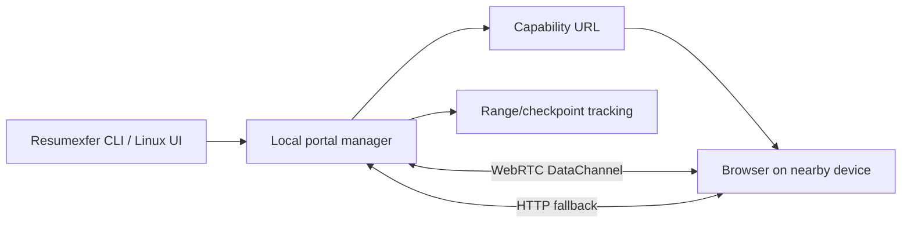

# Resumexfer architecture

Resumexfer has two related transfer paths that share the same integrity and local-network primitives.

## 1. Linux managed USB/MTP path

On Linux Mint/Ubuntu with Nemo and GVfs, Resumexfer takes ownership of cross-device keyboard paste operations so a single component owns progress and recovery.

### Main components

- **Nemo extension** — detects cross-device copy/paste, starts managed jobs, and renders the compact progress/control window.
- **resumexferd** — per-user Linux daemon that serializes managed transfers, owns manifests, and coordinates recovery.
- **Manifest/state store** — records direction, source/destination identity, per-file progress, ownership, pause/cancel state, and reconnect state.
- **Recovery engine** — resumes from durable partial data only after validating the preserved prefix and source identity.
- **GVfs/MTP adapter** — talks to Android storage through the desktop's existing MTP mount.

### Recovery model

**Phone → laptop** writes to a Resumexfer-owned local partial and promotes it only after completion.

**Laptop → phone** re-opens a preserved MTP object in verified append mode when the device/GVfs backend supports it. The actual remote partial size and sampled source/prefix proof are rechecked after reconnect; the last UI counter is never treated as proof.

## 2. Local-network browser portal

The portal is shared by Linux, Windows, and macOS.

- The serving device opens an ephemeral local listener.
- Resumexfer discovers non-loopback IPv4 addresses with Go's cross-platform network APIs.
- The other device opens a temporary capability URL in a normal browser.
- Large/fast browser downloads can use WebRTC DataChannels; HTTP range/upload paths remain available as fallback.
- Docker/container interfaces are filtered from the advertised route list.
- Multi-file downloads can be packaged as a ZIP while preserving relative paths.

No cloud relay or Resumexfer account is required.

## Cross-transport handoff

| Direction | Transition | Behavior |
| --- | --- | --- |
| Phone → laptop | USB → USB | Resume verified partial |
| Phone → laptop | USB → Wi‑Fi | Resume/continue the remaining managed job |
| Phone → laptop | Wi‑Fi → USB | Adopt verified checkpoint and continue |
| Laptop → phone | USB → USB | Resume verified MTP partial when append reopen is supported |
| Laptop → phone | Wi‑Fi → Wi‑Fi | Browser-stored offset resume |
| Laptop → phone | USB → Wi‑Fi | Current partial cannot be appended by an HTTP browser; all remaining files are offered, with multi-file/folder fallback delivered as a ZIP |

The last row is intentionally explicit: a zero-install Android browser cannot transparently acquire write ownership of an MTP-created partial file.

## Data integrity and ownership

Resumexfer uses several layers rather than trusting filenames:

1. file size and source metadata,
2. sampled SHA-256 fingerprints for efficient mismatch detection,
3. full byte comparison where duplicate suppression requires certainty,
4. durable per-entry progress,
5. job ownership flags so whole-job Undo never deletes unrelated pre-existing files.

Ambiguous or changed inputs fail closed.

## Code map

- `cmd/resumexfer/` — cross-platform standalone Share/Receive CLI.
- `cmd/resumexferd/` — Linux per-user managed-transfer daemon.
- `internal/portal/` — local browser portal, WebRTC path, capability links, upload/download resume.
- `internal/recovery/` — managed USB/MTP recovery engine.
- `internal/state/` — manifest and transfer persistence.
- `internal/gvfs/` — Linux GVfs/MTP integration.
- `internal/daemon/` — Linux daemon control plane.
- `nemo/` — Nemo extension and GTK progress/portal UI.
- `packaging/` — Debian/systemd packaging.
- `scripts/test-batches/` — focused security, race, reconnect, performance, fuzz, UI, and transfer-matrix suites.

## Design principles

- **One authoritative transfer owner** for managed jobs.
- **Resume from verified bytes, not optimistic counters.**
- **Never overwrite or delete unowned data.**
- **Local-first networking** with no cloud requirement.
- **Browser interoperability** rather than requiring a companion phone app.
- **Fail closed** when identity, ownership, or append safety is uncertain.
